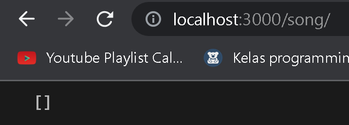
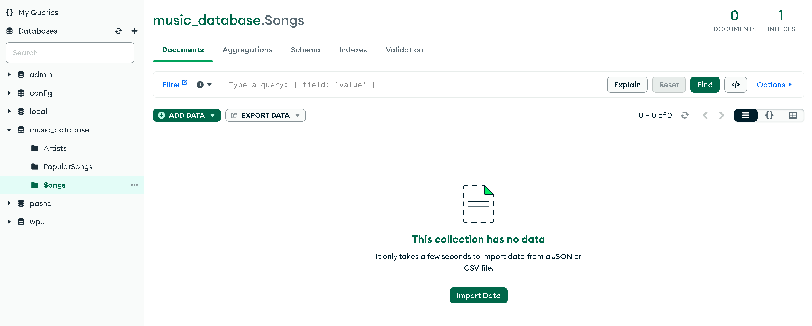
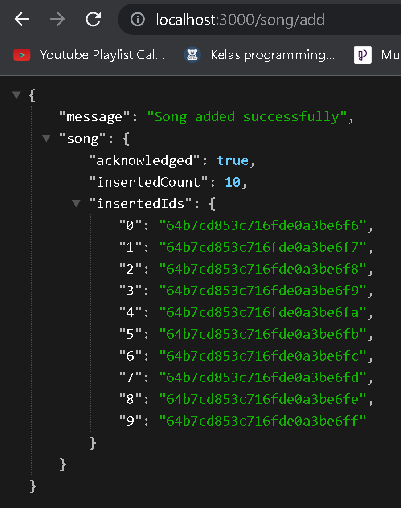
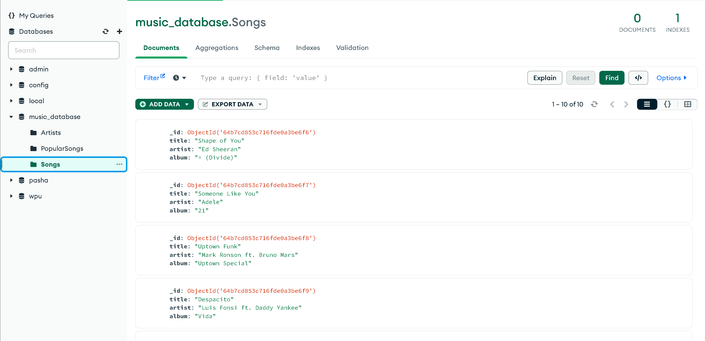
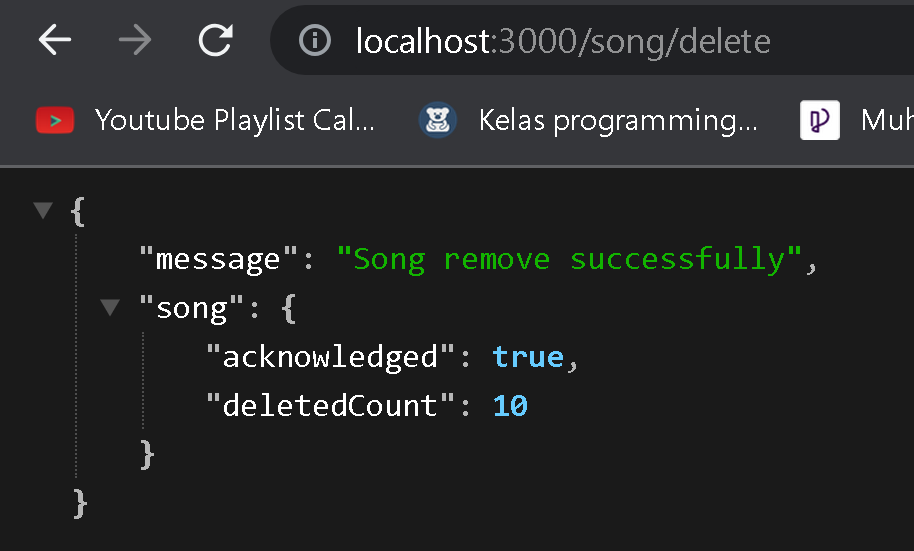

Database "music_database"

SONG
a. "/song" // Menampilkan data song yang ada pada database

Database :

b. "/song/add" // Menambahkan data pada database berdasarkan songsData.js

Database :
 // Data berjumlah 10

c. "/song/delete" // Menghapus semua data pada database

Database :

Hal yang sama juga berlaku pada playlist dan artist
